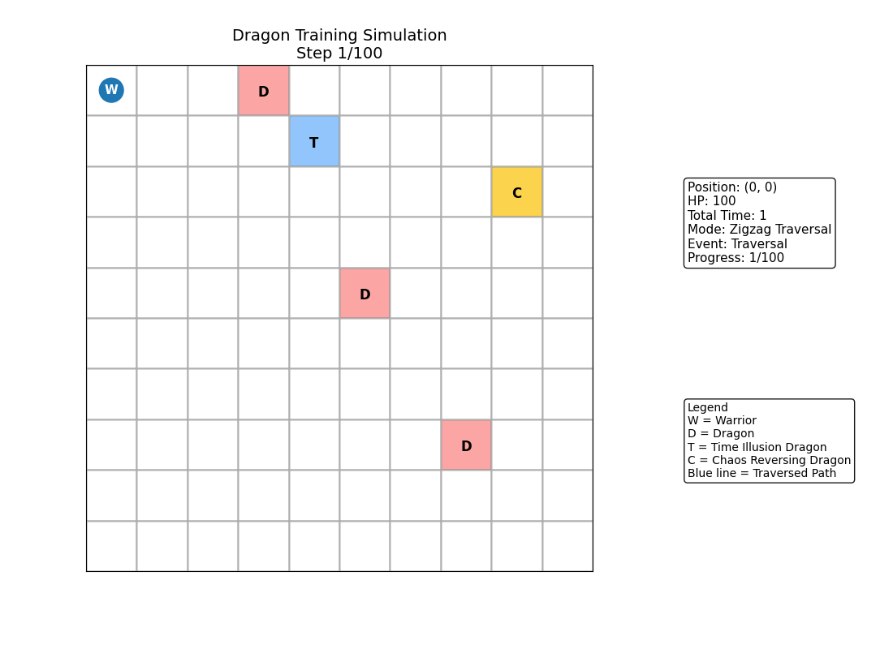

# Dragon Training System
### How to Train Your Dragon – Part I

## Project Overview

The **Dragon Training System** is a simulation-based program written in **C++** that models a warrior navigating a dragon-infested map.

The system processes a **10×10 grid-based battlefield** where the warrior must locate key positions, encounter dragons, and resolve battles while managing health points and special dragon effects.

The objective of the simulation is to determine the **total time required** for the warrior to complete the mission while correctly handling all dragon interactions and map constraints.

This project was developed as part of a **programming assignment focused on simulation and algorithmic problem solving**.

---

## Key Features

### Map-Based Simulation
- Fixed **10×10 grid map**
- Detection of special locations
- Grid traversal and state tracking

### Battle Mechanics
- Combat time calculation
- Warrior health management
- Dragon elimination tracking

### Special Dragon Behaviors
Certain dragons introduce special gameplay effects:

- **Time Illusion Dragon** – modifies battle time calculations
- **Chaos Reversing Dragon** – alters traversal direction or movement behavior

These effects require additional logic during the simulation process.

---

---

## Simulation Flow

```
Load Map
   ↓
Locate Special Positions
   ↓
Traverse Grid
   ↓
Encounter Dragon
   ↓
Compute Battle Time
   ↓
Update Warrior HP
   ↓
Apply Special Dragon Effects
   ↓
Continue Traversal
   ↓
Compute Total Time
```

---

## Battle Map Visualization

The simulation takes place on a **10 × 10 grid-based battlefield**.  
Each cell may represent an empty location, a dragon encounter, or a special position affecting the warrior's journey.

Example conceptual map:

```
+----+----+----+----+----+----+----+----+----+----+
| W  | 0  | 0  | D  | 0  | 0  | 0  | 0  | 0  | 0  |
+----+----+----+----+----+----+----+----+----+----+
| 0  | 0  | 0  | 0  | T  | 0  | 0  | 0  | 0  | 0  |
+----+----+----+----+----+----+----+----+----+----+
| 0  | 0  | D  | 0  | 0  | 0  | 0  | 0  | C  | 0  |
+----+----+----+----+----+----+----+----+----+----+
| 0  | 0  | 0  | 0  | 0  | 0  | 0  | 0  | 0  | 0  |
+----+----+----+----+----+----+----+----+----+----+
| 0  | 0  | 0  | 0  | 0  | D  | 0  | 0  | 0  | 0  |
+----+----+----+----+----+----+----+----+----+----+
```

Legend:

| Symbol | Meaning |
|------|--------|
| **W** | Warrior starting position |
| **D** | Dragon encounter |
| **T** | Time Illusion Dragon |
| **C** | Chaos Reversing Dragon |
| **0** | Empty cell |

During traversal, the warrior moves across the grid, encounters dragons, and updates the system state accordingly.

Special dragons modify the traversal behavior or battle time calculations, making the simulation more complex.

---

## Animated Simulation



---

## Core Function

The main simulation logic is implemented in the following function:

```cpp
void totalTime(int map[10][10], int warriorDamage, int HP);
```

### Responsibilities

- Traverse the map
- Handle dragon encounters
- Update warrior health points
- Track defeated dragons
- Apply special dragon effects
- Compute the total battle time required to complete the mission

---

## Supporting Functions

Examples of helper functions used in the system:

- `findHeritageLocation(...)`
- `findKeyLocation(...)`
- `findTimeIllusionDragon(...)`
- `findChaosReversingDragon(...)`
- `CalculateTime(...)`
- `CalculateHP(...)`
- `ForwardorBackward(...)`

These functions help separate different components of the simulation, improving **modularity and code readability**.

---

## Project Structure

```
Dragon-Assignment
│
├── dragon.h
├── dragon.cpp
├── main.h
├── main.cpp
│
├── run.sh
│
├── tnc_tc_01_input.txt
├── tnc_tc_02_input.txt
├── ...
├── tnc_tc_14_input.txt
│
├── main.exe
└── README.md
```

---

## How to Compile and Run

### Compile

```bash
g++ -o main main.cpp dragon.cpp -I . -std=c++11
```

### Run

```bash
./main tnc_tc_01_input.txt
```

⚠ The assignment is evaluated in a **Unix environment**.

---

## Algorithm Complexity

| Component | Complexity |
|----------|------------|
| Map traversal | O(N²) |
| Battle simulation | O(N²) |
| State tracking | O(N²) |

Where **N = 10**, representing the dimension of the grid map.

---

## Learning Outcomes

This project demonstrates:

- 2D array manipulation
- Simulation-based algorithm design
- Structured C++ programming
- Function decomposition and modular design
- State management during simulation

---

## Notes

- No additional headers are allowed (assignment constraints)
- Code must compile using **C++11**
- The core simulation logic is implemented in `dragon.cpp`

